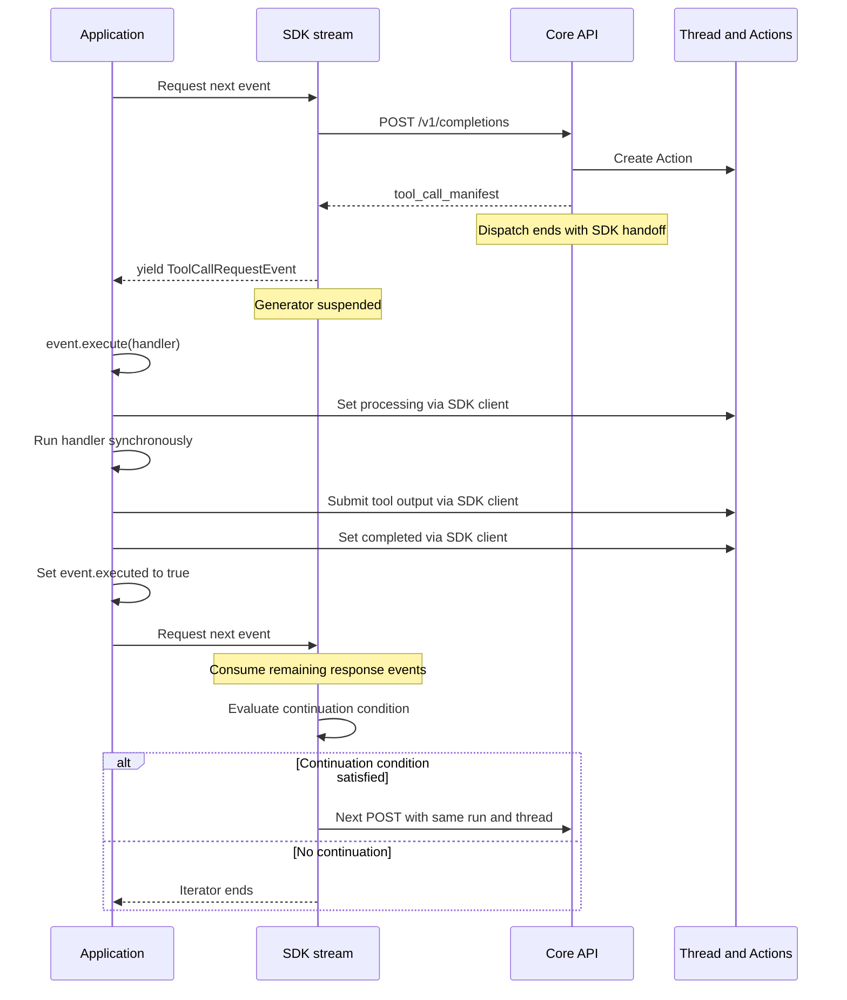

# Consumer tools: handling and signalling architecture

Implementation reference: Core and SDK source reviewed on 2026-09-28.

This document describes the legacy SDK-managed consumer-tool path: how Core
hands work to an application, how results return to the conversation, and what
starts the next inference request. It also explains how this path coexists with
Core-managed platform and MCP tools. Review notes describe the implementation
as observed; they are not changes implemented by this document.

## Architectural overview

A consumer tool is executed by application code outside Core. Core records the
requested action and streams a `tool_call_manifest`. The SDK converts that
manifest into a `ToolCallRequestEvent`, which the application executes through
its local tool registry.

The SDK submits the result through the API, updates the action, and marks the
event as handled. Its event generator then decides whether to open another
inference request using the same run and thread.

The central distinction is:

- **Core hands off and returns** when an inference batch contains an SDK tool.
- **The SDK owns continuation** across the resulting HTTP request boundaries.
- **Thread messages carry the result** into subsequent inference.
- **`event.executed` is the local continuation signal** in the unified SDK loop.
- **Action and run statuses are stored lifecycle state**; that loop does not
  poll them to decide whether to continue.

A single application `for` loop therefore spans multiple HTTP requests. It does
not imply one HTTP connection or one suspended Core invocation for the entire
conversation.

## Ownership and source map

| Component | Responsibility |
| --- | --- |
| Core `OrchestratorCore.process_conversation()` | Runs inference, identifies SDK tools in the batch, dispatches tools, and chooses internal continuation or SDK handoff. |
| Core `ConsumerToolHandlersMixin._handover_to_consumer()` | Normalises the call, creates its Action, and emits the consumer manifest or executes a bound MCP tool. |
| SDK `SynchronousInferenceStream.stream_events()` | Maps chunks into events, validates consumer arguments, yields events, and decides whether to request another turn. |
| SDK `SynchronousInferenceStream.stream_chunks()` | Drives the asynchronous inference response through a synchronous generator. |
| SDK `InferenceClient.stream_inference_response()` | Opens `POST /v1/completions` and parses the SSE response. |
| SDK `ToolCallRequestEvent.execute()` | Calls the execution helper and sets the event's `executed` flag when the helper reports the action handled. |
| SDK `RunsClient.execute_pending_action()` | Calls the application's tool executor, submits success or error output, and updates the Action status. |
| Application tool registry and callback | Resolve the tool name and perform the actual operation. |

Core source locations:

- `src/api/entities_api/orchestration/engine/orchestrator_core.py`
- `src/api/entities_api/orchestration/mixins/consumer_tool_handlers_mixin.py`
- `src/api/entities_api/orchestration/mixins/tool_routing_mixin.py`

SDK source locations supplied with this review:

- `src/projectdavid/events.py`
- `src/projectdavid/clients/runs.py`

The stream and inference implementations are identified here by class and method
because their SDK module paths were not included in the reviewed extracts.
The `process_tool_calls()` call site was reviewed; its implementation and the
server's tool-output API handler were outside the supplied extracts.

## Core dispatch and handoff

After inference, `process_conversation()` obtains the tool-call batch and checks
every call. A call is classified as an SDK consumer tool when its name is absent
from `PLATFORM_TOOLS` and has no bound MCP executor:

```python
if (
    tool_name not in PLATFORM_TOOLS
    and self._get_mcp_tool_executor(tool_name) is None
):
    has_sdk_user_tool = True
```

Core then consumes `process_tool_calls()` and forwards its events. After dispatch,
the presence of any SDK tool causes this exit:

```python
if has_sdk_user_tool:
    return
```

This ends the current Core orchestration generator, including its `finally`
cleanup. It does not execute the next internal inference turn. The run can remain
in `pending_action`; returning from a request is not the same as completing the
logical run.

For the consumer route, `_handover_to_consumer()`:

1. Builds a `ToolCallEnvelope` from the legacy call and its identifiers.
2. Creates an Action using the tool name, arguments, run, and tool-call ID.
3. Checks whether a bound MCP executor owns that name.
4. If no MCP executor exists, yields the manifest when an Action ID is available.
5. Writes the run status as `pending_action` after the yield resumes.

The current status write occurs **after** manifest publication. Core's yield is
a handoff to its stream consumer, not an acknowledgement from the remote SDK.
The server and application may therefore progress independently at that point.
If no Action ID is returned, this branch emits no manifest but still attempts
the `pending_action` update.

## Manifest and identifier contract

The consumer manifest has this shape:

```json
{
  "type": "tool_call_manifest",
  "run_id": "run_example",
  "action_id": "action_example",
  "tool_call_id": "call_example",
  "tool": "get_flight_times",
  "args": {
    "departure": "LAX",
    "arrival": "JFK"
  }
}
```

| Field | Meaning |
| --- | --- |
| `run_id` | Logical run associated with the work. SDK continuation reuses this run. |
| `action_id` | Stored Action used for execution status and bookkeeping. |
| `tool_call_id` | Correlates the assistant's tool request with the corresponding tool result in conversation history. |
| `tool` | Name used to select the application's handler. |
| `args` | Arguments passed to that handler. |

`action_id` and `tool_call_id` are distinct identifiers. In the SDK's message
submission API, `tool_id=action_id` associates the result with the Action, while
`tool_call_id` preserves conversation correlation. Tool name or batch position
does not replace that correlation: one batch may call the same tool repeatedly.

The SDK constructs the event with the thread, assistant, and clients bound to
`SynchronousInferenceStream`. Its mapper uses the configured run ID for the
event. The manifest does not carry the local function, SDK clients, or the
`executed` flag. Those exist only in the receiving Python process.

## Normal synchronous round trip

This diagram shows the successful consumer path. Core's lifecycle status write
and network delivery are not an acknowledgement protocol; their ordering is
described separately above.



The application normally consumes events like this:

```python
for event in stream.stream_events(model=MODEL_ID):
    if isinstance(event, ToolCallRequestEvent):
        handler = TOOL_REGISTRY.get(event.tool_name)
        if handler is not None:
            event.execute(handler)
```

This fragment illustrates the normal path only. An unresolved handler needs an
explicit policy; silently skipping an event leaves its result outstanding.

`stream_events()` yields the actual event object and suspends. The application's
`event.execute()` call runs before the `for` loop asks for another event. After
execution, the SDK generator resumes and observes the mutated flag on that same
object:

```python
yield event
if isinstance(event, ToolCallRequestEvent):
    last_tool_call = event
```

The synchronisation comes from ordinary synchronous generator control flow. A
long-running handler delays generator advancement; it does not cause the SDK to
start its next request early.

This assumes the handler returns the operation's result. Starting background work
and immediately returning a job acknowledgement changes the contract: the SDK
will treat that acknowledgement as the tool result. Tool duration can still
affect connection timeouts and operational behaviour, but it does not change
this execution ordering.

## Result submission and action status

`ToolCallRequestEvent.execute()` delegates to
`RunsClient.execute_pending_action()`. On the normal path, the helper performs:

```python
actions_client.update_action(action_id, status="processing")
result_content = tool_executor(tool_name, streamed_args)

if not isinstance(result_content, str):
    result_content = json.dumps(result_content)

messages_client.submit_tool_output(
    thread_id=thread_id,
    tool_id=action_id,
    tool_call_id=tool_call_id,
    content=result_content,
    role="tool",
    assistant_id=assistant_id,
)
actions_client.update_action(action_id, status=StatusEnum.completed.value)
return True
```

The exception path attempts to submit a JSON error result, marks the Action
`failed`, and also returns `True`. Therefore:

> `event.executed == True` means the SDK helper reported the action handled,
> including a submitted error result. It does not mean the tool succeeded.

The flag is set after the submission and status calls return. If recovery itself
raises, the exception propagates and the event is not marked executed by that
call. The broad exception handler covers tool execution, submission, and status
updates; this code alone does not establish transactional or exactly-once
semantics across those operations.

| State or signal | Role in this path |
| --- | --- |
| Run `pending_action` | Stored lifecycle state indicating tool work is involved. It does not itself trigger SDK continuation. |
| Action `processing` | Written before the local callback executes. |
| Tool message | Supplies success or error content to the conversation. |
| Action `completed` / `failed` | Written after the corresponding output submission returns in the execution helper. |
| Event `executed` | Process-local flag inspected by the unified SDK continuation loop. |

Completing an Action does not mean the Run has completed. The model may need to
consume the result, request another tool, or produce its final response.

Core also has a method named `submit_tool_output()`, backed by `_native_exec`,
for outputs submitted by Core orchestration code. `submit_tool_result()` projects
a `ToolResultEnvelope` into that string-based persistence path. The legacy SDK
uses `messages_client.submit_tool_output()` through the API; matching method
names do not prove that the API handler invokes the orchestration mixin.

## Exact next-turn trigger

At the end of each SDK response cycle, `stream_events()` evaluates:

```python
if validation_failed_this_turn or (
    last_tool_call and last_tool_call.executed
):
    LOG.info(
        f"[SyncStream] Self-Correction triggered. Turn {turn_count + 1}"
    )
    continue

break
```

The `continue` starts another iteration of the SDK's outer `while` loop. That
iteration calls `stream_chunks()`, which creates a new
`stream_inference_response()` generator. When driven, the inference client opens:

```python
async with client.stream(
    "POST", "/v1/completions", json=payload
) as response:
    ...
```

The payload reuses the configured `run_id`, `thread_id`, `assistant_id`, and
`message_id`. The tool result is not attached to that new inference payload; it
has already been submitted to the conversation through the message API.
Subsequent context assembly must make the correlated assistant call and tool
result available to the provider.

The log label `Self-Correction triggered` also appears after successful tools.
It identifies continuation, not necessarily a failure or a correction.

There is no action-status polling, Redis notification subscription, or sleep
between handled consumer tools and this continuation decision. Redis-backed
conversation caching is a separate concern. For example, Core's
`_save_assistant_message()` appends assistant content to its message cache so
later context construction can see that history; it is not the SDK's readiness
signal.

The SDK's `max_turns` default is `10` response cycles. Core's
`process_conversation()` default is `200` internal inference turns per invocation.
These are separate limits. A Core-only tool sequence can contain multiple
internal turns within one SDK response cycle.

## Batch behaviour and current boundaries

Core checks the whole inference batch for SDK tools. A mixed batch containing
platform or MCP work and at least one SDK consumer call still takes the SDK
handoff exit after dispatch.

In the application pattern above, consumer events are executed sequentially:
each inline `event.execute()` finishes before the next event is requested. A
model emitting a batch does not make those local callbacks concurrent.

For valid calls that the application all handles inline, exhausting the response
occurs after those submissions. The current SDK nevertheless records only
`last_tool_call`, not an explicit completion record for every call.

| Situation | Current continuation behaviour |
| --- | --- |
| One valid tool is handled inline | Requests the next turn after submission and response consumption. |
| Several valid tools are all handled inline | Processes them sequentially, then continues based on the last event. |
| An earlier call is skipped but the last call is handled | Requests the next turn despite the earlier unresolved call. |
| The last call is skipped | Ends this SDK generator without automatic continuation. |
| Argument validation fails | Submits an error, breaks out of response consumption, and requests another turn. |

The validation branch sets `event.executed = True` directly, sets
`validation_failed_this_turn`, and breaks. It does not call the normal execution
helper. In the reviewed code its error submission omits `tool_call_id` and it
does not explicitly finalise the Action status. Later manifests in that response
may remain unread. These are SDK-side observations; any additional checks or
status changes in the server's message handler require inspection of that handler.

The implementation therefore has deterministic synchronous ordering but no
explicit whole-batch completion gate. Parallel workers, manually submitted
results, or skipped handlers must not treat the last event's flag as proof that
all expected results exist. Manually submitting an output also does not mutate
the original Python event automatically.

## Platform tools, MCP tools, and alternative consumer helpers

| Route | Execution owner | Continuation mechanism |
| --- | --- | --- |
| Platform tool | Core | Core's internal conversation loop, unless the batch also contains an SDK tool. |
| Bound MCP tool | Core through `McpToolExecutor` | Core persists the result and can continue internally. No consumer manifest is emitted for that bound call. |
| Legacy consumer tool | Application through the SDK event | SDK submits the output and decides whether to issue another HTTP request. |

The bound MCP branch also lives in `_handover_to_consumer()`, despite that
method's name. It sets `pending_action`, awaits remote execution, and submits a
typed result through Core. Its cancellation helper polls the Run every `0.5`
seconds and rechecks the Run after execution completes. On an observed
cancellation it cancels or discards the execution result and returns `None`.
Those mechanisms belong to the MCP branch; they are not a background monitor
for the SDK's local callback.

`RunsClient` exposes other consumer execution mechanisms, but the unified stream
described here does not invoke them:

| Helper | Mechanism |
| --- | --- |
| `poll_and_execute_action()` | Polls the Run for `pending_action` and obtains pending Actions. |
| `watch_run_events()` | Listens to `/v1/runs/{run_id}/events` for `action_required`. |
| `execute_delegated_action()` | Executes intercepted delegated work using the supplied origin identifiers. |

Do not infer the unified stream's signalling contract from those alternatives.
`ToolInterceptEvent` is also distinct from `ToolCallRequestEvent`; it is not
counted by the latter's `last_tool_call` check.

## Maintenance reference

When changing this architecture, preserve the following contracts:

1. Preserve `tool_call_id` from assistant intent through every success or error
   result. Keep it distinct from the Action ID.
2. Record the tool result before treating the call as handled for continuation.
3. Preserve Core's SDK-handoff exit; a consumer call must not accidentally enter
   the internal inference loop while its result is outstanding.
4. Keep each `SynchronousInferenceStream` instance scoped to one request flow.
   Its `setup()` fields are mutable and must not be shared by concurrent flows.
5. Treat a completed batch as all expected calls having submitted outcomes, not
   merely the last call completing. Any concurrent execution must join that
   whole batch before resuming inference.

Potential hardening points recorded by this review are whole-batch completion
tracking, consuming the remaining batch after validation errors, consistent error
correlation and Action finalisation, an explicit missing-handler policy, and
writing `pending_action` before exposing the consumer manifest. They are not
prerequisites for the synchronous generator's existing wait behaviour, and this
document does not claim that those changes have been applied.

For tracing an existing run, follow the manifest's identifiers into the Action
and tool message, then inspect the SDK's `Self-Correction triggered` log and the
next `/v1/completions` request. That sequence identifies both the result handoff
and the component that requested continuation.
