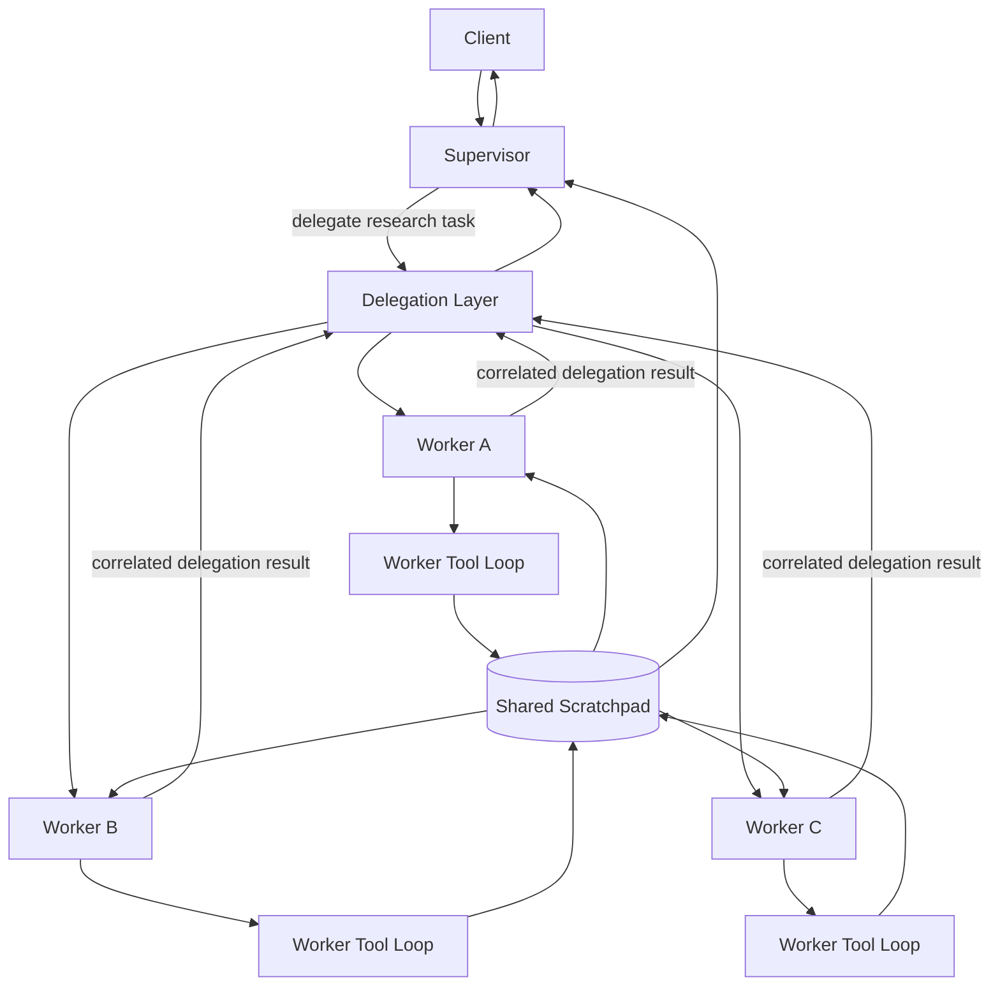
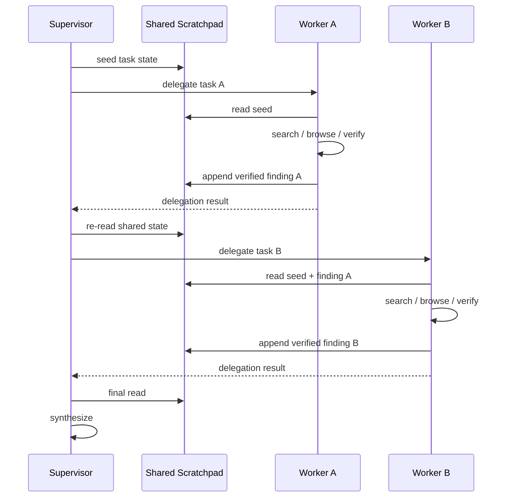

# Deep Research Architecture

Project David Deep Research is a bounded, multi-agent research execution architecture designed around two primary failure modes of long-horizon LLM work:

1. **Context pollution** — allowing every search result, page read, failed lead, tool response, retry, and intermediate reasoning step to accumulate in the supervisor conversation.
2. **Unbounded chaotic execution** — allowing autonomous research loops to recurse indefinitely, lose protocol state, or report partial work as successful.

The architecture separates **research execution**, **shared research state**, and **supervisor synthesis** so that workers can perform messy, multi-step research without transferring their entire working history into the parent context.

The result is not simply a collection of cooperating agents. It is a small probabilistic execution system with explicit boundaries for state, protocol correlation, failure, and termination.

---

## 1. Design Goals

Deep Research is intended to provide the following properties:

- keep the supervisor context compact;
- allow workers to perform multi-turn autonomous research;
- allow multiple workers to share verified findings;
- preserve strict tool-call / tool-result correlation;
- prevent worker-local protocol traffic from leaking to the client;
- bound worker execution;
- distinguish worker failure from worker success;
- preserve deterministic conversation chronology;
- make research progress observable while execution is in flight;
- allow the supervisor to synthesize results from durable research state rather than worker transcript exhaust.

The core design principle is:

> **Workers may have noisy execution histories. Shared research state should contain only information deliberately promoted into it.**

---

## 2. High-Level Architecture



The supervisor plans and synthesizes.

Workers research.

The scratchpad carries durable cross-worker findings.

The worker conversation remains worker-local.

---

## 3. The Two Execution Planes

Deep Research deliberately separates two different forms of state.

### 3.1 Conversation Plane

The **conversation plane** is the worker's actual inference history.

It contains protocol-sensitive messages such as:

- assistant messages;
- tool calls;
- tool results;
- model reasoning;
- worker-local context;
- retries and intermediate execution state.

Each delegated worker operates on its own conversation thread.

This is where provider protocol integrity matters.

```text
worker thread
    │
    ├── assistant
    │      └── tool_calls
    │
    ├── tool result
    │
    ├── tool result
    │
    ├── assistant
    │
    └── ...
```

The conversation plane is **not** the shared research memory.

### 3.2 Shared Research Plane

The **shared research plane** is the scratchpad.

It exists to carry deliberately promoted research state between:

- supervisor → worker;
- worker → worker;
- worker → supervisor.

Typical contents include:

- task seed information;
- verified facts;
- citations or source notes;
- compact findings;
- coordination markers;
- state required by a later worker.

```text
Shared Scratchpad

[seed from supervisor]

[Worker A verified finding]

[Worker A marker]

[Worker B acknowledgement]

[Worker B verified finding]

[supervisor synthesis notes]
```

The scratchpad is intentionally much smaller and cleaner than worker execution history.

---

## 4. Why the Scratchpad Exists

Without the scratchpad boundary, long-running research tends toward:

```text
search query
    ↓
search result
    ↓
page content
    ↓
tool response
    ↓
reasoning
    ↓
failed lead
    ↓
retry
    ↓
more page content
    ↓
more reasoning
    ↓
parent context
    ↓
context pollution
```

Deep Research instead promotes only selected information:

```text
Internet / external sources
          ↓
        Worker
          ↓
   research + verification
          ↓
  deliberate scratchpad write
          ↓
   Shared Scratchpad
          ↓
      Supervisor
```

The supervisor therefore consumes **research state**, not the complete history of how that state was produced.

This is the primary context-pollution control mechanism.

---

## 5. Scratchpad Thread Semantics

A worker has two thread identities that must never be conflated.

```text
conversation_thread_id
    = worker's own inference conversation

scratchpad_thread_id
    = shared parent research state
```

Conceptually:

```python
conversation_thread_id = thread_id
scratchpad_thread_id = scratch_pad_thread or thread_id
```

Scratchpad operations use:

```text
scratchpad_thread_id
```

Correlated tool-result submission uses:

```text
conversation_thread_id
```

This distinction is fundamental.

If a worker tool result is written into the shared scratchpad thread instead of the worker conversation thread, the provider sees a broken tool protocol.

The architecture therefore treats:

> **conversation state and shared research state as different data planes.**

---

## 6. Supervisor Responsibilities

The supervisor owns research orchestration rather than detailed execution.

Its responsibilities include:

- decomposing the research problem;
- deciding when delegation is required;
- seeding shared state;
- issuing bounded worker tasks;
- observing worker progress;
- re-reading the scratchpad after worker completion;
- deciding whether further delegation is needed;
- synthesizing the final answer.

The supervisor does **not** need the complete worker transcript.

A typical supervisor lifecycle is:



---

## 7. Worker Responsibilities

A research worker is an ephemeral autonomous executor.

A worker may:

- read the shared scratchpad;
- perform web search;
- read web pages;
- search within pages;
- scroll pages;
- verify information;
- append findings to the scratchpad.

Its working context is disposable.

Its promoted findings are durable.

A worker lifecycle is approximately:

```text
delegate
   ↓
create ephemeral worker context
   ↓
read shared scratchpad
   ↓
search
   ↓
browse
   ↓
reason
   ↓
verify
   ↓
append promoted result
   ↓
return correlated delegation result
   ↓
terminate
```

---

## 8. Bounded Autonomous Execution

Research workers are autonomous, but not unbounded.

The current research worker turn budget is:

```text
RESEARCH_WORKER_MAX_TURNS = 8
```

The purpose of the turn budget is not to force all research into one model call.

It exists to provide enough space for a realistic sequence such as:

```text
read state
→ search
→ inspect
→ refine
→ inspect
→ verify
→ write result
```

while still providing a hard execution ceiling.

The design therefore rejects both extremes:

```text
max_turns = 1
```

is too restrictive for meaningful research.

Unlimited recursion is operationally unsafe.

Deep Research uses **bounded autonomy**.

---

## 9. Worker Tool Registry

There is a distinction between the worker assistant's persisted tool declaration and the runtime-expanded tool implementation.

### 9.1 Persisted Worker Declaration

The persisted worker assistant exposes the logical research capabilities:

```python
RESEARCH_WORKER_ASSISTANT_TOOLS = [
    {"type": "web_search"},
    read_scratchpad,
    append_scratchpad,
]
```

This keeps persisted assistant configuration within the supported tool namespace.

### 9.2 Runtime Tool Expansion

At runtime, the worker can use the concrete execution functions:

```python
WORKER_TOOLS = [
    perform_web_search,
    read_web_page,
    search_web_page,
    scroll_web_page,
    read_scratchpad,
    append_scratchpad,
]
```

This separation prevents internal platform implementation functions from being persisted as if they were ordinary externally declared assistant functions.

The reserved function namespace remains protected.

---

## 10. Delegation Is a Protocol Boundary

Delegation is not merely a Python function call.

From the supervisor's perspective, delegation behaves like a tool execution with a strict lifecycle:

```text
supervisor tool call
        ↓
DelegationMixin
        ↓
ephemeral worker run
        ↓
worker execution
        ↓
correlated delegation tool result
        ↓
supervisor continuation
```

The parent supervisor must always receive a correlated result for the delegation call.

That result may represent:

```text
success
```

or:

```text
error
```

but the protocol must be closed honestly.

---

## 11. Failure Semantics

A worker is not successful merely because it emitted some prose.

Provider failure must propagate through the worker lifecycle.

The required failure chain is:

```text
provider exception
    ↓
worker stream raises
    ↓
OrchestratorCore catches
    ↓
worker run receives failure state
    ↓
DelegationMixin observes failed execution
    ↓
partial worker prose is discarded
    ↓
correlated delegation result is returned with is_error=True
    ↓
delegation action fails
    ↓
supervisor receives an honest failed tool result
```

This avoids a dangerous failure mode:

```text
worker produces partial text
    ↓
provider crashes
    ↓
exception converted into text
    ↓
delegation layer sees some content
    ↓
false DELEGATE_SUCCESS
```

The architecture explicitly rejects that behaviour.

---

## 12. Provider Exception Ownership

Provider workers must not swallow inference exceptions and convert them into ordinary streamed content.

For the Qwen/Together path, provider exceptions are allowed to propagate:

```python
except Exception:
    raise
```

The higher orchestration layer owns run failure lifecycle.

This is important because only the orchestration layer has enough context to correctly update:

- run status;
- `last_error`;
- failure timestamps;
- emitted failure events;
- delegation result state.

---

## 13. Partial Output Is Not Success

A delegated worker may emit useful-looking text before an inference failure.

That text is not sufficient evidence of completed execution.

Delegation therefore maintains explicit failure state.

Conceptually:

```text
execution_had_error = True
```

causes partial worker output to be discarded as the final delegation result.

The supervisor instead receives a correlated error result.

This protects synthesis from accidentally consuming incomplete research as verified work.

---

## 14. Tool-Call Correlation

Research frequently requires parallel tool use.

For example, a worker may simultaneously:

```text
read_scratchpad
perform_web_search
```

Each tool invocation has an independent `tool_call_id`.

The provider protocol requires a corresponding result for every call.

```text
assistant
    tool_calls:
        call_read
        call_web

tool
    tool_call_id = call_read

tool
    tool_call_id = call_web
```

Those messages must remain independent.

---

## 15. Protocol Messages Are Atomic

The conversation truncation/normalization layer must not merge structured protocol messages.

The following are atomic:

- any `role="tool"` message;
- any message containing `tool_calls`;
- any message containing `tool_call_id`.

Only ordinary adjacent conversational messages may be merged.

Why:

```text
tool result A
tool result B
```

cannot safely become:

```text
merged tool result
tool_call_id = A
content = A + B
```

because the provider will correctly conclude that tool call B was never answered.

This invariant protects parallel tool execution.

---

## 16. Conversation Truncation Must Respect Protocol Structure

Context reduction is allowed to compress ordinary conversational content.

It must not destroy tool-call groups.

Conceptually, this sequence is one protocol unit:

```text
assistant(tool_calls=[A, B])
tool(A)
tool(B)
```

Removing or merging individual members can make the remaining history invalid.

The current architecture already prevents protocol-message merging.

A further hardening area is token-budget truncation: protocol groups should eventually be removed or retained atomically rather than as unrelated individual messages.

---

## 17. Deterministic Message Ordering

Tool protocol also depends on deterministic chronology.

Wall-clock timestamps are insufficient when multiple messages can be persisted within the same second.

Deep Research therefore relies on a canonical monotonic persistence order:

```text
Message.sequence_no
```

The database provides:

```text
BIGINT
NOT NULL
AUTO_INCREMENT
UNIQUE
```

Conversation reads use `sequence_no` as the authoritative ordering mechanism.

This prevents a tool result from being reordered relative to the assistant tool call that created it.

The distinction is:

```text
created_at
    = event time

sequence_no
    = canonical persistence order
```

For provider conversation reconstruction, `sequence_no` is the stronger ordering primitive.

---

## 18. Worker Isolation

Workers are deliberately ephemeral.

They should not become permanent participants in the supervisor's context.

Isolation provides several benefits:

- tool chatter remains local;
- failed search paths remain local;
- temporary assumptions remain local;
- provider-specific reasoning remains local;
- token pressure remains local;
- one worker cannot accidentally rewrite another worker's conversation history.

Cross-worker communication happens through the scratchpad rather than transcript sharing.

---

## 19. Cross-Worker Collaboration

Two workers do not need direct conversation with each other.

They collaborate through durable state.

Example:

```text
Supervisor:
    writes seed

Worker A:
    reads seed
    performs research
    writes finding A
    writes marker A

Supervisor:
    confirms marker A exists

Worker B:
    reads seed
    reads finding A
    reads marker A
    performs independent research
    writes finding B
    acknowledges marker A

Supervisor:
    reads complete shared state
```

This pattern gives workers indirect coordination without requiring context inheritance.

---

## 20. Client Boundary

Internal Deep Research tools are platform-controlled.

They are not intended to surface as client-side tool execution requests.

During a successful Deep Research run:

```text
CLIENT_TOOL_REQUEST_SURFACED = NO
LOCAL_TOOL_EXECUTOR_USED = NO
```

The supervisor and workers use Core's internal tool handling path.

This is important because delegation, scratchpad access, and internal research tooling are implementation details of the orchestration runtime rather than requests for the SDK consumer to execute locally.

---

## 21. Observability

Long-running research must be observable while still hiding internal protocol noise from the client.

The architecture emits structured events such as:

- `ResearchStatusEvent`;
- `ScratchpadEvent`;
- `ReasoningEvent`;
- `ContentEvent`.

This allows a consumer to observe:

```text
research started
worker delegated
worker researching
scratchpad updated
worker completed
supervisor synthesizing
```

without exposing internal worker tool protocol as consumer tool requests.

The desired split is:

```text
internal execution protocol
        ≠
external progress signalling
```

---

## 22. Successful End-to-End Contract

The current integration test proves the following sequence:

```text
Supervisor
    ↓
seed shared scratchpad
    ↓
delegate Worker A
    ↓
Worker A reads seed independently
    ↓
Worker A researches first fact
    ↓
Worker A appends verified finding + unique marker
    ↓
Supervisor re-reads scratchpad and observes marker
    ↓
delegate distinct Worker B
    ↓
Worker B reads seed + Worker A marker
    ↓
Worker B performs independent research
    ↓
Worker B appends second finding + matching acknowledgement
    ↓
Supervisor re-reads complete shared state
    ↓
parent run completes
```

Acceptance requires:

```text
INFERENCE_STREAM=PASS
CORE_TOOL_BOUNDARY=PASS
SHARED_SCRATCHPAD=PASS
DEEP_RESEARCH_INTEGRATION=PASS
WORKER_FAILURE_LIFECYCLE=PASS
```

It also requires that no client tool request escape the internal orchestration boundary.

---

## 23. Core Implementation Seams

The Deep Research architecture spans several Core components.

### `DelegationMixin`

Owns delegated worker execution.

Responsibilities include:

- launching delegated research;
- observing worker status;
- collecting output;
- handling worker failure;
- producing the correlated supervisor tool result;
- preventing partial failed output from becoming success.

### `ScratchpadMixin`

Owns shared research-state access.

Its central invariant is the separation between:

```text
conversation_thread_id
```

and:

```text
scratchpad_thread_id
```

Scratchpad reads/writes operate on the latter.

Tool protocol responses remain on the former.

### `AssistantManager`

Creates/configures the research worker assistant and applies its bounded turn budget.

### `research_worker.py`

Defines the research worker's logical and runtime tool capabilities.

Key concepts:

```text
RESEARCH_WORKER_ASSISTANT_TOOLS
WORKER_TOOLS
RESEARCH_WORKER_MAX_TURNS
```

### `ConversationTruncator`

Controls conversation compaction while preserving structured protocol messages as atomic records.

### `MessageService`

Reconstructs persisted conversation chronology using deterministic `sequence_no` ordering.

### `QwenBaseWorker`

For the Together/Kimi research path, provider exceptions propagate upward so that OrchestratorCore can own the failure lifecycle.

---

## 24. Architectural Invariants

The following invariants define the system.

### State

```text
worker conversation != shared scratchpad
```

### Correlation

```text
every tool_call_id must receive its own correlated result
```

### Ordering

```text
provider history is reconstructed by canonical persistence order
```

### Delegation

```text
partial output + failed execution != success
```

### Failure

```text
provider failure must reach orchestration lifecycle
```

### Context

```text
worker transcript is local
promoted research state is shared
```

### Autonomy

```text
workers may loop
workers may not loop without a hard bound
```

### Client boundary

```text
internal research tools do not become consumer tool requests
```

---

## 25. Failure Modes This Architecture Prevents

### Context flooding

**Failure:** every worker observation enters the supervisor context.

**Protection:** shared scratchpad promotion boundary.

### Worker protocol corruption

**Failure:** scratchpad thread identity replaces worker conversation identity.

**Protection:** separate conversation and scratchpad thread IDs.

### Lost parallel tool result

**Failure:** adjacent tool messages are merged.

**Protection:** protocol messages are atomic.

### Tool-call reordering

**Failure:** multiple same-second messages sort unpredictably.

**Protection:** monotonic `sequence_no`.

### False delegation success

**Failure:** provider fails after producing partial text.

**Protection:** exception propagation + explicit worker failure state + correlated error result.

### Infinite worker execution

**Failure:** research agent loops indefinitely.

**Protection:** bounded worker turn budget.

### Internal tool leakage

**Failure:** research tooling is surfaced to the SDK consumer for execution.

**Protection:** Core-owned internal tool routing.

---

## 26. Conceptual Model

The architecture can be understood as four layers.

```text
┌───────────────────────────────────────────────┐
│                 SUPERVISOR                    │
│      planning · delegation · synthesis        │
└──────────────────────┬────────────────────────┘
                       │
┌──────────────────────▼────────────────────────┐
│              DELEGATION CONTROL               │
│ lifecycle · correlation · failure · bounds    │
└──────────────────────┬────────────────────────┘
                       │
          ┌────────────┼────────────┐
          ▼            ▼            ▼
      ┌────────┐   ┌────────┐   ┌────────┐
      │Worker A│   │Worker B│   │Worker C│
      │tool loop│  │tool loop│  │tool loop│
      └────┬───┘   └────┬───┘   └────┬───┘
           │            │            │
           └────────────┼────────────┘
                        ▼
              ┌──────────────────┐
              │ SHARED SCRATCHPAD│
              │ promoted research│
              │ durable findings │
              └──────────────────┘
```

The supervisor operates on distilled shared state.

Workers operate on noisy local state.

Delegation controls execution.

The scratchpad is the information membrane between them.

---

## 27. Deep Research as a Systems Problem

The architecture treats LLM research as more than model prompting.

Once a model can:

- call tools;
- perform multiple turns;
- delegate work;
- operate concurrently;
- share state;
- fail independently;

the runtime acquires properties normally associated with distributed execution systems.

The important engineering concerns become:

```text
state isolation
message ordering
correlation
bounded execution
failure propagation
durable shared state
observability
protocol integrity
```

The model is probabilistic.

The orchestration contract should not be.

---

## 28. Summary

Project David Deep Research is built around one central idea:

> **Do not make the supervisor carry the complete execution history of research.**

Instead:

```text
Supervisor
    plans

Workers
    explore

Tools
    produce noisy observations

Scratchpad
    carries promoted research state

Delegation
    enforces lifecycle and failure semantics

Message ordering
    preserves protocol chronology

Truncation
    preserves structured tool boundaries

Supervisor
    synthesizes from durable findings
```

This allows research to be long-running and autonomous without allowing execution history to become unbounded parent context.

The architecture therefore solves the two original design problems directly:

```text
context pollution
    → isolated worker conversations + promoted shared scratchpad state

chaotic long-running loops
    → bounded workers + explicit delegation lifecycle + strict failure semantics
```

That is the Deep Research execution model in Project David.
